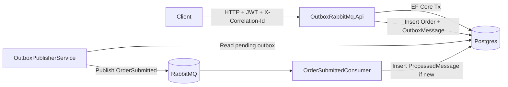

# .NET 9 API Starter (Clean Architecture + Outbox RabbitMQ sample)

This repository provides two deliverables:

1. **API template** under `src/` using Clean Architecture boundaries (`Domain`, `Application`, `Infrastructure`, `Api`).
2. **Outbox sample** under `samples/OutboxRabbitMq` demonstrating transactional EF Core outbox + background publisher + MassTransit RabbitMQ consumer with idempotency.

## Features

- RFC7807 global exception handling with `traceId` + `correlationId`
- Correlation ID middleware (`X-Correlation-Id`) and propagation to logs and message headers
- Serilog request logging + structured logging
- OpenTelemetry traces and metrics
- Health checks at `/health`
- JWT authentication + Swagger authorize button
- Rate limiting defaults enabled
- Dockerfile for API runtime
- `docker-compose.yml` for API + RabbitMQ + Postgres
- Outbox table (`OutboxMessages`) persisted in the same DB transaction as business data
- Idempotent consumer using `ProcessedMessages` with unique index on `(ConsumerName, MessageId)`
- Integration test project with Testcontainers

## Repository layout

```text
src/
  Domain/
  Application/
  Infrastructure/
  Api/

samples/
  OutboxRabbitMq/
    src/OutboxRabbitMq.Api/
    tests/OutboxRabbitMq.IntegrationTests/
```

## Architecture



## Quick start

### Prerequisites

- .NET 9 SDK
- Docker + Docker Compose

### Run local API sample with containers

```bash
docker compose up --build
```

Then open:

- Swagger: `http://localhost:8080/swagger`
- Health: `http://localhost:8080/health`
- RabbitMQ UI: `http://localhost:15672` (`guest` / `guest`)

### Build solution

```bash
dotnet restore
dotnet build dotnet9-api-starter.sln
```

### Run integration tests

```bash
dotnet test samples/OutboxRabbitMq/tests/OutboxRabbitMq.IntegrationTests/OutboxRabbitMq.IntegrationTests.csproj
```

## Notes

- For integration tests, authentication can be disabled via config `Auth:Disable=true`.
- Update JWT keys and connection strings for production.
- The template API (`src/Api`) uses in-memory storage to keep scaffolding simple.
